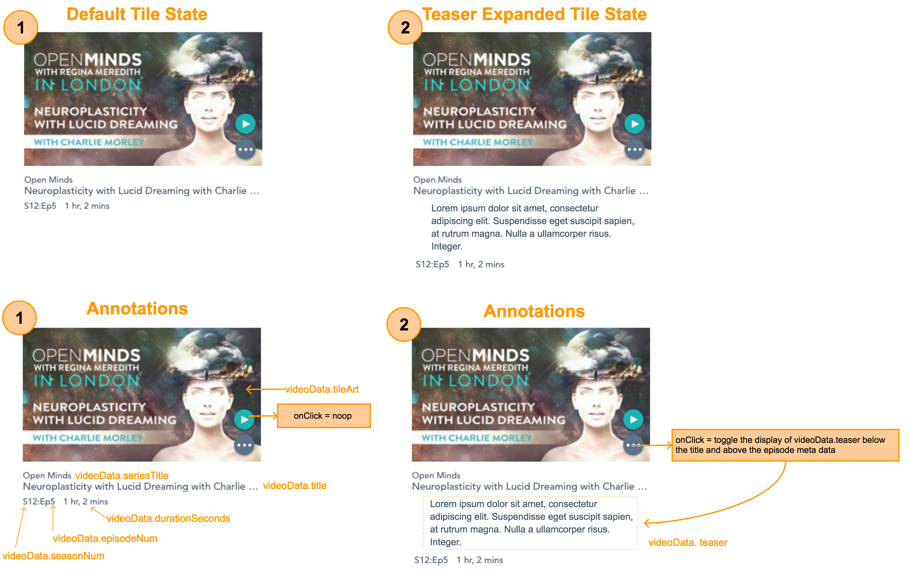

This project was bootstrapped with [Create React App](https://github.com/facebook/create-react-app).

## Early Career Front End Developer Code Challenge

### Pre-requisites
1. npm >= v5.2
   * Other package managers can be used so long as they are supported by `Create-React-App`
1. Nodejs >= v8.x
1. Two open terminals at the root of the application

### Running the project:
1. `npm install` to install dependencies
1. `npm start` to run the React application
1. In the other terminal, `npm run server` to run the express server on port: 9001
1. In the browser of your choice, navigate to `localhost:3000`

### Basic Structure:
1. The React application:
   * Uses Redux for global state management
   * Makes http requests to sibling Express server with Axios
2. The Express server (`/src/server`):
   * Receives http requests from the React application
   * Make http requests to public Gaia API's using Axios
3. Redux pipeline
   * Actions:
     * Dispatched by the React Application to trigger middleware and reducers
   * Middleware:
     * Listens for actions and maps them to handlers > await an http request to the express server
       * Handles success by dispatching a success action
       * Handles failure by dispatching a failure action
     * Then calls `next(action)` to pass the action to the reducers
   * Reducer - Handles updating application state based on certain actions

### Orienting yourself
* Once the project is running, open the codebase in your editor of choice
* Navigate to `/src/App.js`
* Find the TODO comment in the render method
* Find the render method for `<App />`, you will see `videoData`, `videoProcessing`, and `videoError`
  * These variables are hydrated from data in the redux store which is populated on mount of `<App />`
  * `videoProcessing` - Indicates whether or not a video data request is being made
  * `videoError` - Is the error message, should an http request for video data fail
  * `videoData` - Is a video object in the form:
``` js
  videoData = {
    tileArt: string,
    seriesName: string,
    title: string,
    seasonNum: number,
    episodeNum: number,
    durationSeconds: number,
    teaser: string,
  }
```

### Guidelines
1. Install and use any packages you wish
1. Add any folders and files you may need to organize your code
1. This codebase has Redux Dev tools enabled
   * [Chrome Extension](https://chrome.google.com/webstore/detail/redux-devtools/lmhkpmbekcpmknklioeibfkpmmfibljd?hl=en)
1. This challenge should take ~ 2hrs

### Acceptance Criteria
**Please meet as many of the following criteria as you can in the allotted time**

1. Build a `<Tile />` component from `videoData`:


1. UI requirements:
   * **All text within the video thumbnail image in the mock is part of the image**
   * Tile container `width: 420px;`
   * The video title should never exceed 1 line
     * It should hide overflowing text and add an ellipse
     * (as seen next to `videoData.title` in the mock)
   * Format videoData.durationSeconds to `(HH) hr, (MM) mins`
   * Specific styles:
      * Play button - `background-color: #01b4b4;`
      * Play button hover - `background-color: #007172;`
      * Ellipse button - `background-color: #5c738;`
      * Ellipse hover - `background-color: #44576b;`
      * `font family : Arial`
   * Use your best approximation for spacing elements within the tile
   * For any styling that is undefined, make your best effort to preserve the sprit of the mock image above
   * OPTIONAL - add any additional UI/UX polish
     * Skipping this step will **not** be counted against you

1. UX Requirements:
   * Play button `(>)` - onClick:
     * Noop
   * Ellipse button `(...)` - onClick:
     * Toggle display of the video teaser (see 2 in mock)

### What is being tested for:
  * Does the solution satisfy the acceptance criteria?
  * Understanding of React rendering lifecycle
  * Effective State management
  * Concise CSS
  * Well-defined Component Structure
